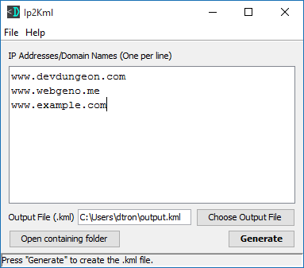

Ip2Kml
======

Provide a list of IP addresses or domain names and Ip2Kml will generate
a Google Earth KML file with the geolocations of the servers pinned and labeled.

Features
--------
* Generate a .kml file with server locations pinned.
* Load a file containing IP addresses or domain names.
* Blank lines and lines starting with # are ignored.
* Uses https://freegeoip.net tp perform geolocation.
* Manually enter output file name or use the "Choose file" option.

Download JAR
------------
* [Ip2Kml from DevDungeon.com](http://www.devdungeon.com/content/ip2kml)

Source Code
-----------
* [Ip2Kml (GitHub.com)](https://www.github.com/DevDungeon/Ip2Kml)

Running
-------
* Ensure Java 7 or greater is installed
* Double click the .jar file or run at the command line with:

`java -jar BinauralGenerator-1.0.jar`

Contact
-------
NanoDano <nanodano@devdungeon.com>
http://www.devdungeon.com

License
-------
GPLv2. See LICENSE.txt in project.

Changelog
---------
v1.0 - 2016/10/20 - Initial stable release.